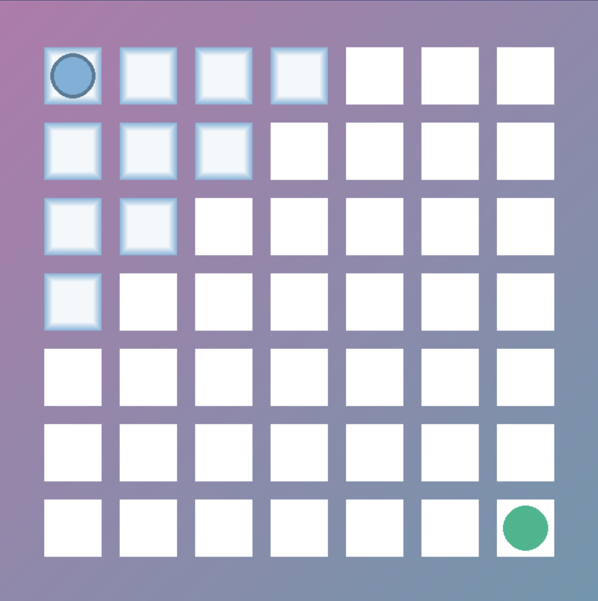
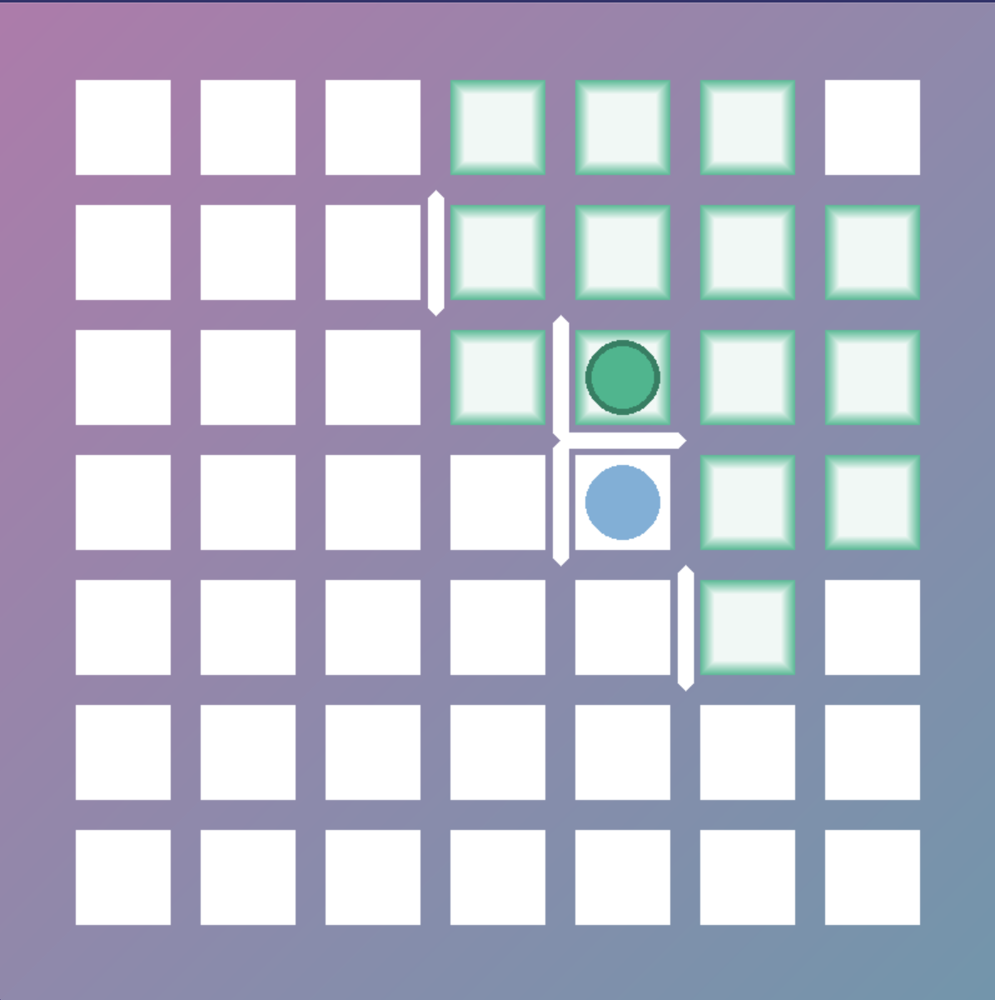
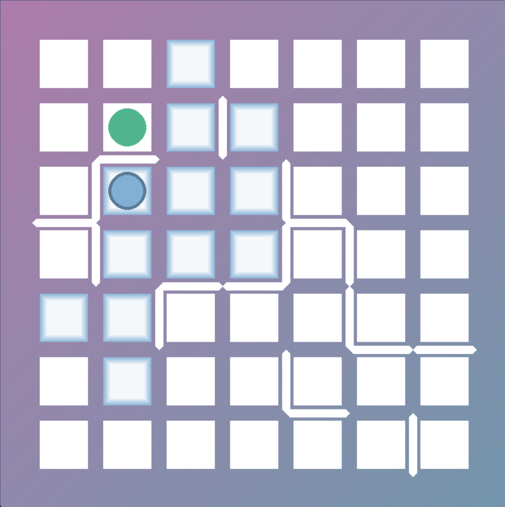
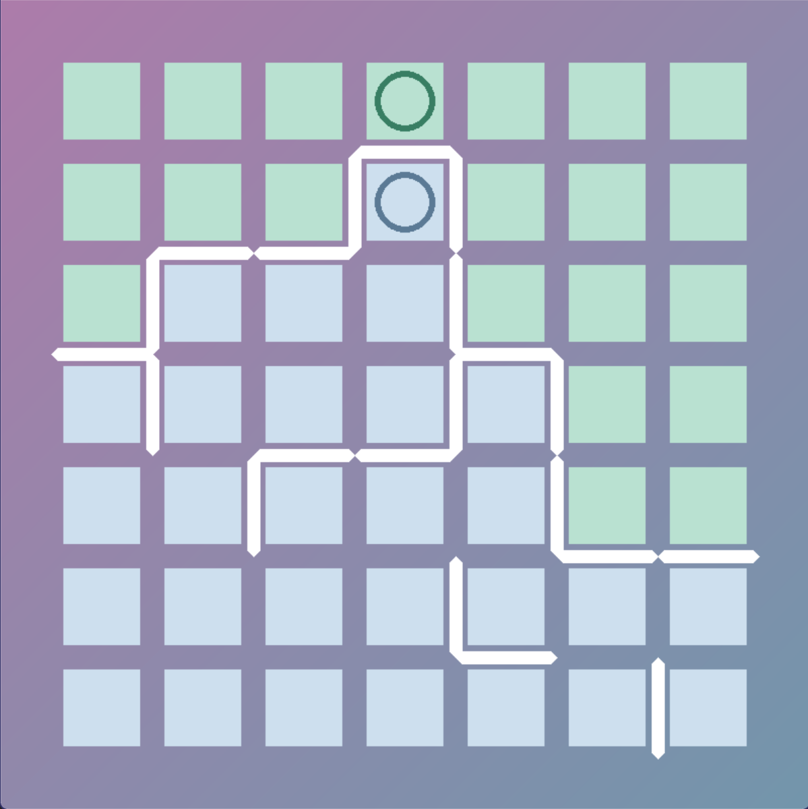

<p align="center">
  
</p>
  <h1 align="center">
  Alpha Besieged City
</h1>

<p align="center">
  A RL-based AI model of board game "Besieged City"
</p>

<p align="center">
  <a style="text-decoration:none">
    
  </a>

  <a style="text-decoration:none">
    
  </a>

  <a style="text-decoration:none">
    
  </a>

  <a style="text-decoration:none">
    
  </a>

  <a style="text-decoration:none">
    
  </a>
</p>

## Quick start

1. Create virtual environment:

    ```shell
    conda create -n Alpha_Besieged_City python=3.10.8
    conda activate Alpha_Besieged_City
    pip install -r requirements.txt
    ```

2. Install `PyTorch`，refer to the [blog](https://www.cnblogs.com/zhiyiYo/p/15865454.html) for details；


3. Start game:

    ```shell
    conda activate Alpha_Besieged_City 
    python game.py
    ```

## Game Rules of _Besieged City_

### Game Board

* The game board is officially a **7x7 grid**, but you can change it to any size you want.
* This game if played with 2 players. **Player Blue** is started on the left top corner, and **Player Green** is started
  on the right bottom corner.

### Move and Place

* **Player Blue** goes first, then two player go in turn. Each turn, a player  **move** his/her pieces, **_AND_** *
  *place** a new wall on the
  board.
* A **step** of move is defined as moving a piece to a neighboring grid (up, down, left, right) that is not occupied by
  another piece or blocked by a wall.
* A legal move can go **0~3** steps, which means the player can stay at the same grid.
* After move, the player **_MUST_** place a wall on the board. The wall can only be placed on one of the **_four sides_
  **
  of the grid that the player move to. Walls cannot be placed on another wall or on the outer edge of the board.

### Win or Lose

* The game ends when two players's pieces are **completely seperated** by walls, which means one player cannot reach the
  other no matter how many steps he/she moves.
* A player's territory is the number of grids that he/she can reach when the game ends. A grid that cannot be reached by
  any player is not counted as any player's territory.
* The player with **_more_** territory wins the game.

## Screenshots

### Starting position



### Middle of a game


<p></p>


### Game over



In this case, **Player Blue** wins. (28:21)

## Train model

  ```shell
  conda activate Alpha_Besieged_City 
  python train.py
  ```

## License

Alpha-Besieged-City is licensed under [GPLv3](./LICENSE).

Copyright © 2024 by Kewei-cpu
